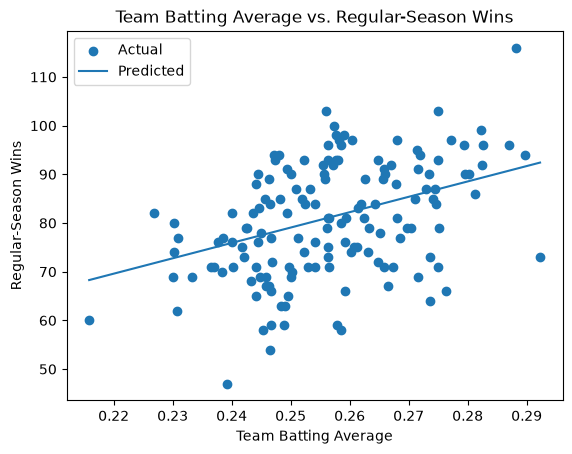
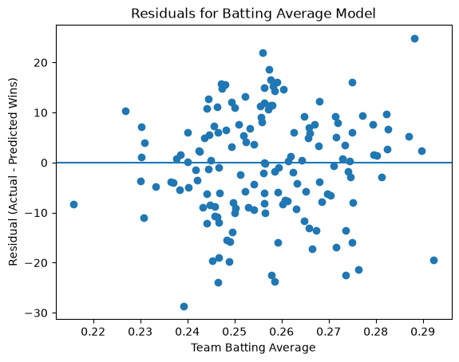

# module6

[](./pyproject.toml)
[](https://docs.astral.sh/uv/)
[](https://docs.astral.sh/ty/)
[](https://docs.astral.sh/ruff/)
[](https://jupyter.org/)
[](https://docs.marimo.io/)
[](https://zensical.org/)
[](./LICENSE)

> Professional Python project: linear regression and predictive analytics using MLB team-season data.

## Project Question

**Can a team's batting average predict the number of regular-season wins it will have?**

This project applies a simple machine learning workflow to Major League Baseball team-season data.

The goal is to investigate whether team batting average provides useful information for predicting the number of regular-season wins.

The project follows a standard predictive modeling process:

```text
OBSERVE
DECLARE
PREPARE
SPLIT
BASELINE
TRAIN
PREDICT
EVALUATE
VISUALIZE
ASSESS
```

## About This Project

This project is a custom application of a linear regression workflow to Major League Baseball team-season data.

Rather than using the example dataset from the original project, I selected baseball data to investigate a question that interests me:

**Can a team's batting average predict the number of regular-season wins it will have?**

The project demonstrates data preparation, train/test splitting, baseline comparison, linear regression, prediction, evaluation, and visualization.

## Key Findings

The analysis found that team batting average has a positive relationship with regular-season wins, but batting average alone is not a strong enough predictor to accurately estimate a team's total wins.

On the test data:

- The mean baseline had an RMSE of **11.78 wins**.
- The linear regression model had an RMSE of **10.61 wins**.
- The linear regression model had an R-squared value of **0.186**.
- The model provided an improvement over the baseline, but substantial variation in team wins remained unexplained.

These results suggest that other factors are needed to build a more complete model of team success.

## What I Learned

This project helped me better understand the complete machine learning workflow from raw data through evaluation.

I learned how to:

- Select a feature and target based on a specific question.
- Prepare real-world data for modeling.
- Create a reproducible train/test split.
- Compare a machine learning model against a baseline.
- Interpret RMSE and R-squared.
- Use prediction and residual plots to evaluate a regression model.
- Recognize that a useful relationship between a feature and target does not necessarily mean that one feature is sufficient for accurate prediction.

## Data

The project uses MLB team-season data from the Lahman Baseball Database.

The primary data file is:

```text
data/raw/Teams.csv
```

Each row represents one MLB team-season.

For this analysis, I used team seasons from **2000 through 2025**, excluding **2020** because it was a shortened 60-game season.

After filtering the data, the analysis contained:

- **750 team-season observations**
- **600 training observations**
- **150 test observations**

### Data Source

The analysis uses the `Teams.csv` team-season dataset from the Lahman Baseball Database.

## Variables

### Feature

The model uses team batting average:

```text
batting average = H / AB
```

where:

- `H` = team hits
- `AB` = team at-bats

### Target

The target is:

```text
W
```

which represents the number of regular-season wins.

## Modeling Approach

The project uses a simple **LinearRegression** model from scikit-learn.

The data is divided into:

- **80% training data**
- **20% testing data**

A fixed random seed of `42` is used so the train/test split can be reproduced.

A simple mean baseline is used for comparison. The baseline predicts the average number of wins from the training data for every test observation.

The model then:

1. Loads the MLB team-season data.
2. Filters the data to 2000–2025 and excludes 2020.
3. Calculates team batting average.
4. Splits the data into training and testing sets.
5. Creates a mean baseline.
6. Trains a linear regression model.
7. Makes predictions on the test data.
8. Evaluates the baseline and model.
9. Creates prediction and residual visualizations.

## Results

The model produced the following results on the test data:

| Model | RMSE | R-squared |
|---|---:|---:|
| Mean baseline | 11.78 wins | -0.002 |
| Linear regression | 10.61 wins | 0.186 |

The linear regression model had a lower RMSE than the baseline.

The model's R-squared value was **0.186**. In this test set, the model accounted for about **18.6% of the variation in wins**.

The regression equation learned from the training data was approximately:

```text
W = 315.710 × batting_avg + 0.138
```

## Interpretation

The results show a positive relationship between team batting average and regular-season wins.

However, the prediction plot shows that the observations are fairly spread out around the regression line. The residual plot also shows substantial variation in prediction errors.

Based on this analysis, team batting average provides some predictive information for regular-season wins, but batting average alone does not explain most of the variation in team wins.

This demonstrates that a feature can have a relationship with a target without being sufficient by itself to make highly accurate predictions.

## Visualizations

### Batting Average and Wins



This chart compares actual team wins in the test data with the wins predicted by the linear regression model.

### Regression Residuals



This chart shows the difference between actual and predicted wins.

Residuals above zero represent predictions that were too low, while residuals below zero represent predictions that were too high.

## Next Steps

A logical next step would be to investigate whether additional offensive statistics improve predictions.

Potential features could include:

- Runs
- Home runs
- Walks
- Stolen bases
- On-base percentage
- Slugging percentage

A future version of the project could compare several models or use multiple features to investigate whether team wins can be predicted more accurately.

## Project Structure

```text
module6/
├── data/
│   └── raw/
│       └── Teams.csv
├── docs/
│   └── images/
│       ├── baseball-batting-average-wins.png
│       └── baseball-regression-residuals.png
├── src/
│   └── datafun/
│       └── app.py
├── project.log
├── pyproject.toml
└── README.md
```

## How to Run

This project uses Python 3.14 and `uv`.

From the project root:

```shell
uv sync
```

Run the analysis with:

```shell
uv run python -m datafun.app
```

The application will:

1. Load the MLB team-season data.
2. Prepare the modeling data.
3. Split the data into training and testing sets.
4. Create a mean baseline.
5. Train a linear regression model.
6. Generate predictions.
7. Evaluate the model.
8. Create prediction and residual visualizations.
9. Record the execution results in `project.log`.

## Development Commands

Format the project:

```shell
uv run ruff format .
```

Check the project with Ruff:

```shell
uv run ruff check . --fix
```

Run type checking:

```shell
uv run ty check
```

Run tests:

```shell
uv run python -m pytest
```

Build the documentation:

```shell
uv run python -m zensical build
```

## Git Workflow

Save changes with:

```shell
git add -A
git commit -m "Update project documentation"
git push
```

## Project Files

- **`data/raw/Teams.csv`** - MLB team-season data used for the analysis
- **`docs/`** - project documentation and visualizations
- **`src/datafun/app.py`** - main Python application
- **`project.log`** - log of the project execution
- **`pyproject.toml`** - project configuration
- **`zensical.toml`** - documentation configuration

## License

This project is licensed under the [MIT License](./LICENSE).
